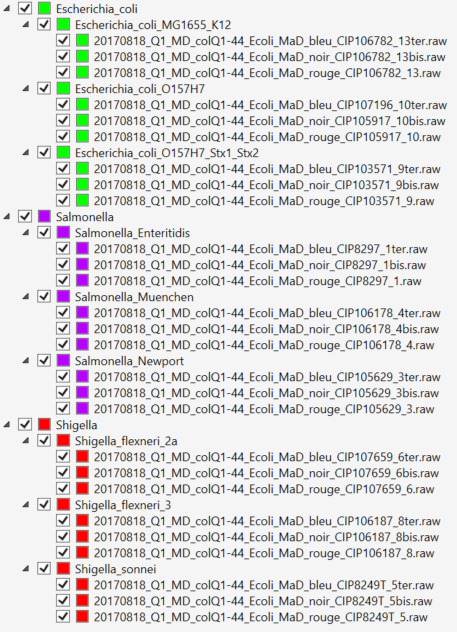
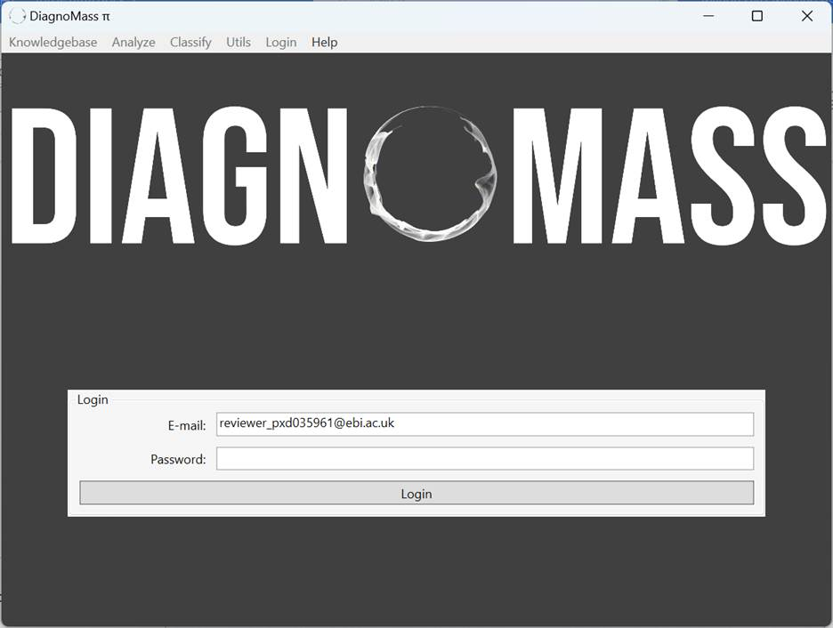
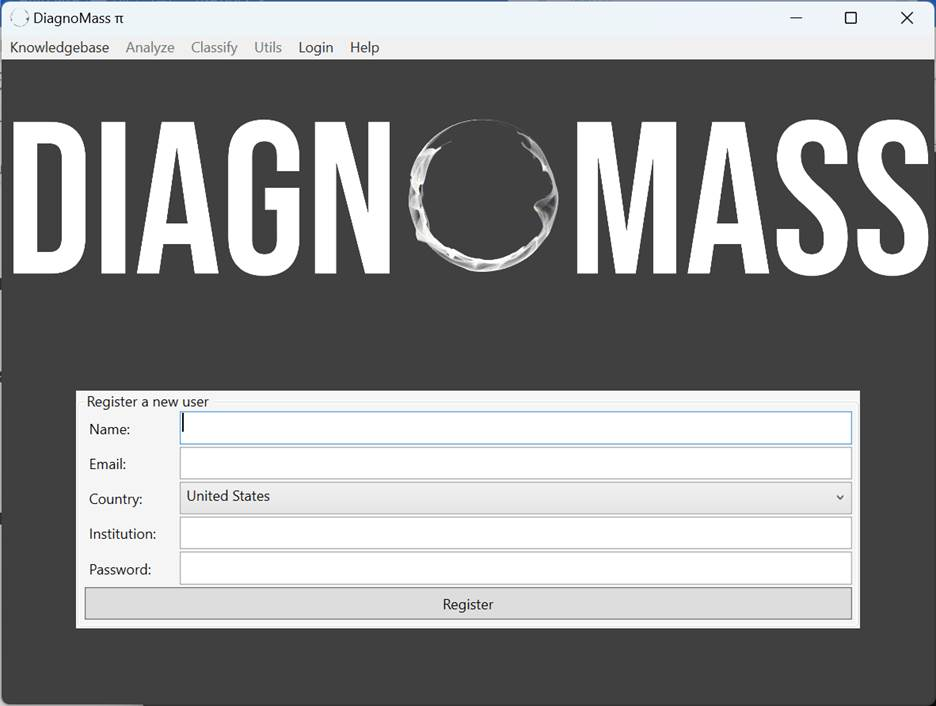
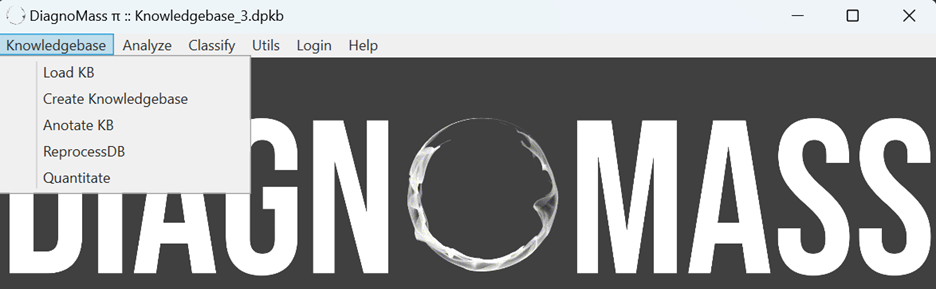
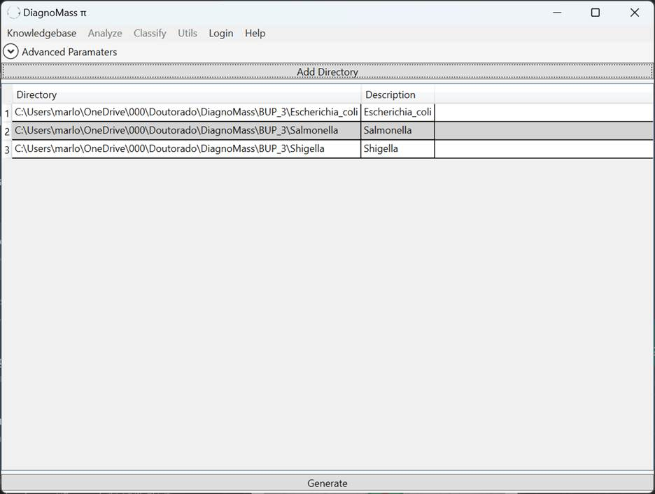
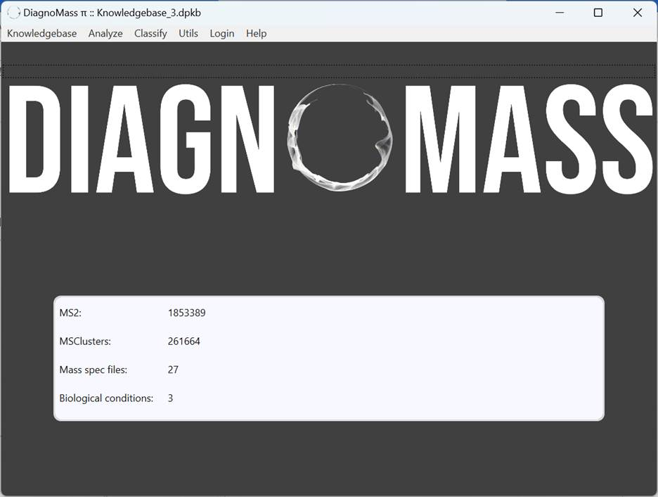
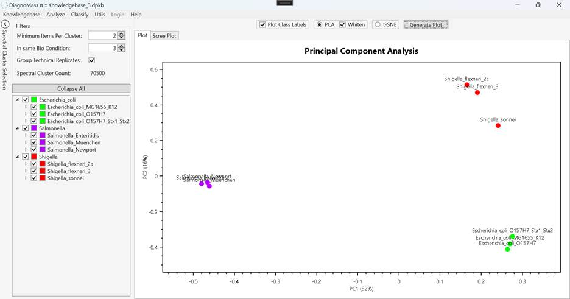
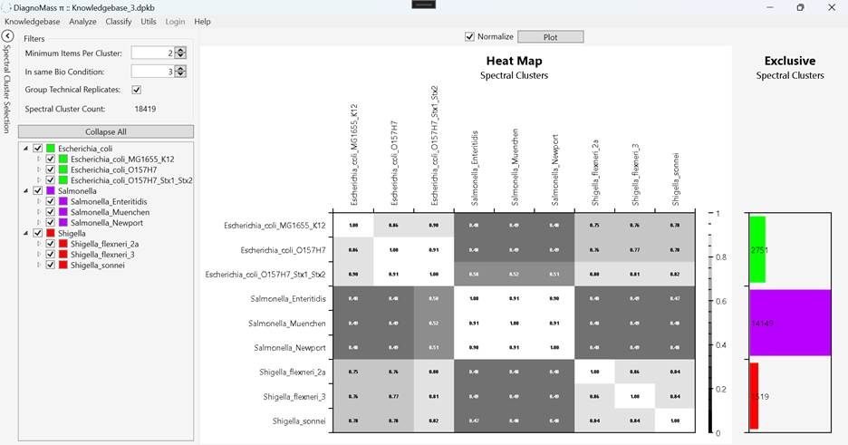
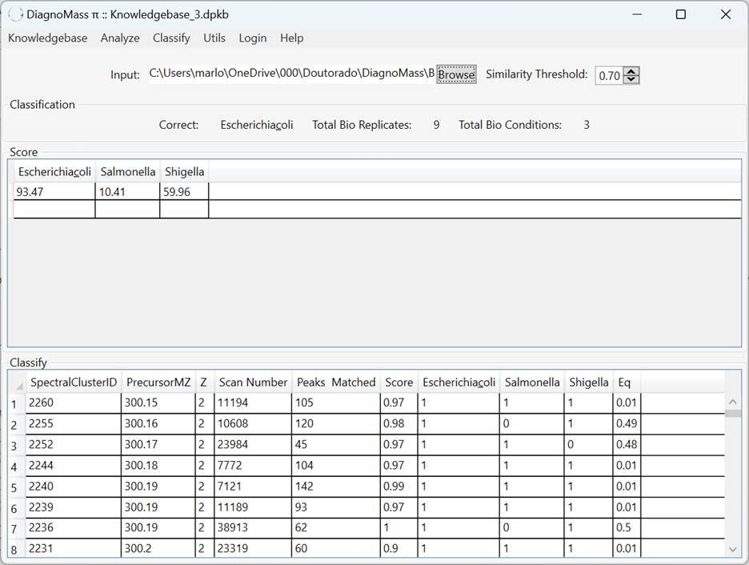

# DiagnoMass Tutorial

## Overview

DiagnoMass is a software tool designed for mass spectrometry data analysis, particularly for proteomics research. This guide provides step-by-step instructions on how to set up, use, and analyze data using DiagnoMass.

## How to Use

### 1. Dataset

You can download an example dataset [here](http://proteomics.fiocruz.br/diagnomass).

### 2. DiagnoMass Setup

- Download the latest version of the DiagnoMass software from this [link](https://www.diagnomass.com/dev/Publish.html) or from [GitHub releases](https://github.com/eumrn/DM/releases).
- Ensure that version 6.0.13 or higher of the .NET Desktop Runtime is installed. If not, you can download it [here](https://dotnet.microsoft.com/en-us/download).

### 3. Data Structure

**Follow the data structure in folders:**

*Figure 1: Follow the folder structure as shown to ensure correct data processing.*

> **Warning:** Visualizing the spectra in item 6.2.1 is necessary to use this data structure. The raw files are deposited in PRIDE (PXD035961).

### 4. Login

*Figure 2: DiagnoMass login screen.*

#### 4.1 Click on Login -> Register New User

*Figure 3: DiagnoMass registration screen.*

DiagnoMass requires a login and password. An existing user creates the login, allowing for the identification of the spread of software use.

### 5. Knowledgebase

#### 5.1 Click on Knowledgebase -> Create Knowledgebase

*Figure 4: Create a new Knowledgebase in DiagnoMass.*

#### 5.2 Click on Add Directory

*Figure 5: Adding a directory to the Knowledgebase.*

#### 5.3 Click on Generate

#### 5.4 Click on Knowledgebase -> Load KB

*Figure 6: Load an existing Knowledgebase.*

> **Warning:** The identification files must be inside the directories.

### 6. Analyze

#### 6.1 Click on Analyze -> Dimensional Reduction

*Figure 7: The dimensionality reduction viewer in DiagnoMass.*

The tree view shows the hierarchy of biological conditions, biological replicates, and technical replicates. Data visualization can provide plots generated with PCA or t-SNE.

#### 6.2 Click on Analyze -> Heatmap

*Figure 8: Heatmap generation in DiagnoMass.*

The comparison of all biological replicates generates a heat map; lighter shades denote more similar samples. On the right is a bar plot showing the number of exclusive spectral clusters for each condition.

#### 6.2.1 Click on Analyze -> Heatmap -> Exclusive Spectral Clusters

*Figure 9: DiagnoMass discriminant cluster explorer.*

### 7. Classify

#### 7.1 Click on Browse and Select the Raw File to Classify

*Figure 10: Select a raw file to classify in DiagnoMass.*

---

